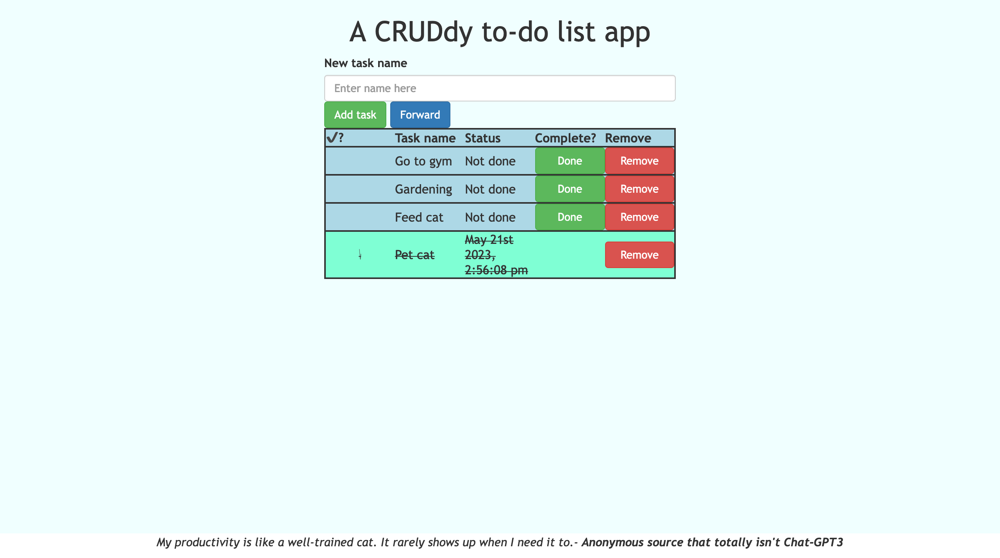

# A CRUDdy To-Do List App

## Description

Duration: A weekend. Backend Saturday. Front-end functionality Saturday. styling Sunday.

This is a simple API and client that creates a to-do list clients can read, write, update, and delete from.

## Technologies

* jQuery
* Node.js
* Express.js
* Moment.js
* PostgreSQL
* Bootstrap
* Sweet alerts

## Client Instructions.

### To add tasks
1. Fill in task name form.
2. Click 'Add task'.
3. Dew it!

### To complete tasks
1. Get done dewing it!
2. Click on complete.
3. Get prideful and see the time and day you have completed the tast (or at least clicked the button).

### To remove tasks.
1. Click on the remove button for a task you wish to remove.
2. When the prompt comes up, click ok.
3. Procrastination awaits.

### To bask in accomplishments.
1. Click reverse button when it is forward.
2. See your already completed tasks first.
3. Click forward button to get back to work.

## Server Instructions.

### To install.
* Have node installed on computer.
* cd to root folder of program.
* npm install express
* npm install pg
* npm install moment.

### To run.
* npm start.

## Server API Documentation.

### Routes:

### GET /task/?reverse='insert true or false here'
This will return an array of objects from the database, sorted depending on if reverse is true or false.
Objects are {id, name, done, timestamp}

Success returns a 200

More details on object data types later in readme.

### POST /task/

This will create a new task in the database. It's data body is only the name of the task. {name}
Success returns a 201.

### PUT /task/:id
This will mark a task as complete. It will throw a 400 on an id that doesn't exist, even if it does pass the validator.

Success returns a 200

### DELETE /task/:id
This will delete one item from the database that matches the id passed in the parameter.

Success returns a 204

## Data

The server database name is 'weekend-to-do-app'

There is only one table "tasks" in the database.

Table data types are:
"id" SERIAL PRIMARY KEY
"name" VARCHAR(250) NOT NULL
"done" BOOLEAN DEFAULT FALSE
"timestamp" TIMESTAMP
